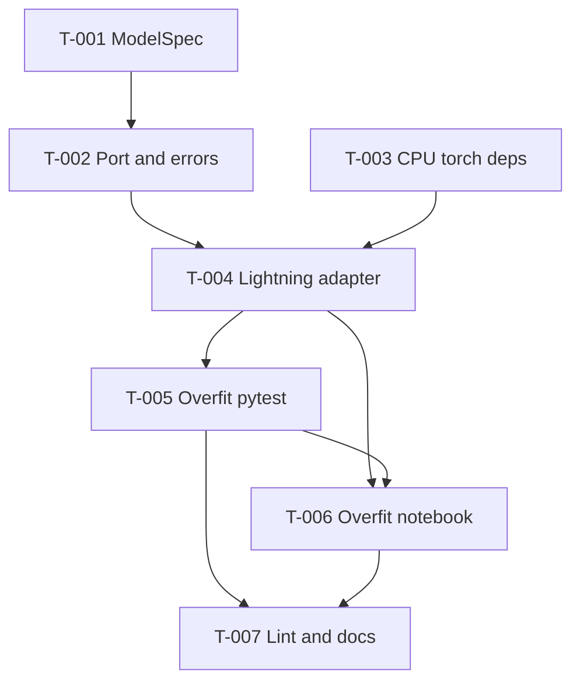

# 001. Causal LM overfit

> Status: Draft
> Created: 2026-10-07
> Request source: agent transcript `c3704cfa-e33d-4c01-a4ce-a9d36e4643cb`

## 1. Task identification

- ID: `001`
- Folder: `001-causal-lm-overfit`
- File: `TASK.md`
- Short title: Causal LM overfit
- Status: `Draft`

## 2. Original user request

- Source: agent transcript `/home/darke/.cursor/projects/home-darke-code-tiny-stories-experiment/agent-transcripts/c3704cfa-e33d-4c01-a4ce-a9d36e4643cb/c3704cfa-e33d-4c01-a4ce-a9d36e4643cb.jsonl`
- Message ID / timestamp: line 1; `<timestamp>Wednesday, Oct 7, 2026, 8:43 PM (UTC+5)</timestamp>`
- Obtained: read the JSONL transcript with `rg` / `head` on 2026-10-07

### Original request

````text
lets make a next step
````

### Clarification

- Source: same transcript, line 7
- Message ID / timestamp: `<timestamp>Wednesday, Oct 7, 2026, 8:45 PM (UTC+5)</timestamp>`
- Obtained: read the JSONL transcript with `rg` on 2026-10-07
- Maps to assistant gates: (1) deliverable, (2) overfit proof, (3) model size, (4) domain modeling, (5) out-of-scope confirmation

````text
1 A, 2B 3A 4A 5Confirm
````

Resolved choices (from the clarification against the assistant’s numbered options):

1. **A** — write `tasks/001-…/TASK.md` first, then stop (this document; no product implementation in the task-creation turn).
2. **B** — overfit proof is CPU pytest **and** notebook `03_overfit_batch.ipynb`.
3. **A** — tiny debug model (~few hundred K params, overfit-optimized).
4. **A** — add `domain/modeling/` types/ports now; Lightning is the adapter under `infrastructure/lightning/`.
5. **Confirm** — skip `make train` wiring, evaluate/generate CLI, and YAML configs until later plan steps.

## 3. Goal

- Outcome: A tiny causal language model exists behind domain modeling types and an application port, with a Lightning adapter; one fixed token batch can be driven to near-zero training loss in an automated CPU test; the same overfit path is demonstrated in `notebooks/03_overfit_batch.ipynb`.
- Motivation: `docs/plan.md` marks this as the first unfinished vertical slice after download/prepare/train-tokenizer. Without a model and an overfit check, later training entrypoints have nothing to wire.
- Success metric: a named pytest reaches final batch loss below the agreed near-zero threshold on CPU; the notebook imports the same package APIs and records the same overfit outcome for an operator.

## 4. Context and scope

### Context

Confirmed from repository evidence (2026-10-07 checkout):

- `docs/plan.md` lists next step 1 as: small causal LM + overfit-one-batch check; success: one fixed batch near-zero loss in a test; model code under `infrastructure/lightning/`.
- Data path and tokenizer slice are implemented under `src/tiny_stories_experiment/` (download, prepare, train-tokenizer, composition, unit/architecture tests).
- `pyproject.toml` has no `torch` / `lightning` dependency today; `uv.lock` has no torch entries. `docs/rocm-training-docker-env.md` states host/CI may use CPU torch from `https://download.pytorch.org/whl/cpu`, while the ROCm image must keep image torch and skip lock torch/triton.
- `make train` only starts Jupyter in the ROCm container; it does not train a language model.
- `domain/modeling/`, `infrastructure/lightning/`, `notebooks/03_overfit_batch.ipynb`, and `train_model` / evaluate / generate commands are marked `[later]` in the plan tree.
- Layer import rules are enforced by `tests/architecture/test_import_rules.py` (domain/application must not import infrastructure, torch stack, or entrypoints).
- Existing domain pattern: frozen dataclasses with validation in `__post_init__` and typed domain errors (e.g. `TokenizerSpec` / `InvalidTokenizerSpecError`).

### In scope

- Domain modeling types for a tiny debug causal LM (validated `ModelSpec` or equivalent) and domain errors for invalid specs.
- Application port(s) that describe the causal LM training step / forward-loss contract without importing torch.
- Lightning adapter under `infrastructure/lightning/` that implements that port and holds the nn.Module.
- Host/CI CPU PyTorch (+ Lightning) dependency wiring that does not break the ROCm image contract (`--no-install-package torch --no-install-package triton`).
- Automated overfit-one-batch pytest on CPU using a fixed synthetic batch.
- Notebook `notebooks/03_overfit_batch.ipynb` that exercises the same overfit path.
- Unit tests for domain spec validation; architecture tests remain green.
- Update `docs/plan.md` markers for this slice when implementation completes (implementation turn, not this document-only turn).
- Operator note in `RUNBOOK.md` for how to run the overfit check / notebook (implementation turn).

### Proposed files and modules

| Path / module | Action | Rationale | Knowledge status |
|---|---|---|---|
| `src/tiny_stories_experiment/domain/modeling/` | create | Domain home for model spec / identities | Proposed |
| `src/tiny_stories_experiment/domain/modeling/model_spec.py` | create | Validated tiny-debug hyperparams (dims, layers, vocab) | Proposed |
| `src/tiny_stories_experiment/domain/errors.py` | modify | Add invalid model-spec (and related) errors | Proposed |
| `src/tiny_stories_experiment/application/ports/causal_language_model.py` | create | Torch-free port for causal LM step/loss | Proposed |
| `src/tiny_stories_experiment/infrastructure/lightning/` | create | Lightning adapter package | Proposed |
| `src/tiny_stories_experiment/infrastructure/lightning/causal_lm.py` | create | nn.Module + LightningModule implementing the port | Proposed |
| `tests/unit/domain/test_model_spec.py` | create | Spec validation cases | Proposed |
| `tests/unit/infrastructure/test_overfit_one_batch.py` | create | CPU overfit-to-near-zero proof | Proposed |
| `notebooks/03_overfit_batch.ipynb` | create | Operator-visible overfit demonstration | Proposed |
| `pyproject.toml` / `uv.lock` | modify | Add CPU torch + lightning for host/CI | Proposed |
| `tests/architecture/test_import_rules.py` | modify | Forbid torch/lightning in domain/application if needed | Proposed |
| `docs/plan.md` | modify | Mark modeling/lightning/overfit items done or partial | Proposed |
| `RUNBOOK.md` | modify | Document overfit test / notebook | Proposed |
| `src/tiny_stories_experiment/composition.py` | inspect | Wire only if a thin factory is needed for notebook/tests; no train CLI | TBD |
| `docker/training/Dockerfile` | inspect | Confirm sync still skips torch/triton after dependency add | Confirmed need |

### Out of scope

- `make train` pointing at a real training entrypoint (plan step 2).
- Full-corpus training, checkpoints under the container volume, or multi-epoch runs.
- Evaluate and generate CLI commands (plan step 3).
- YAML config loader and `config/model/*.yaml` / `config/training/*.yaml`.
- `train_model` / `evaluate_model` / `generate_text` use cases as product CLI flows.
- Notebooks `02_model.ipynb`, `04_generation.ipynb`, and dataset/tokenizer notebooks.
- Parallel package named `tinylm`.
- Re-running the GPU smoke test unless needed to prove the Docker torch skip still holds.

## 5. Requirements

### Functional requirements

| ID | Testable requirement | Source / rationale |
|---|---|---|
| FR-001 | The system shall provide a validated domain model specification for a tiny debug causal LM (vocabulary size, embedding/hidden size, layer count, attention head count, context length, and related limits) that rejects impossible combinations. | Clarification 3A/4A; `TokenizerSpec` pattern |
| FR-002 | The system shall expose an application port for a causal language model training step that accepts token-id batches and returns a scalar training loss without importing torch, lightning, or infrastructure. | Clarification 4A; architecture rules |
| FR-003 | The system shall provide a Lightning adapter under `infrastructure/lightning/` that implements FR-002 and performs next-token prediction (causal LM) for the tiny debug spec. | `docs/plan.md` next step 1; clarification 4A |
| FR-004 | An automated CPU test shall train the Lightning adapter on one fixed synthetic batch until the training loss is near zero. | `docs/plan.md` success criterion; clarification 2B |
| FR-005 | Notebook `notebooks/03_overfit_batch.ipynb` shall import the package model APIs and demonstrate the same overfit-one-batch behavior (fixed batch, reported final loss). | Clarification 2B; plan tree `03_overfit_batch.ipynb` |
| FR-006 | Domain and application layers shall remain free of torch, lightning, entrypoints, and infrastructure imports as enforced by architecture tests. | `tests/architecture/test_import_rules.py`; architecture rule |

### Non-functional requirements

| ID | Measurable constraint | Threshold / condition | Source |
|---|---|---|---|
| NFR-001 | Debug model parameter count | Instantiated model parameter count ≤ 500_000 for the default tiny debug `ModelSpec` used by the overfit test | Clarification 3A (“few hundred K”) |
| NFR-002 | Near-zero overfit loss | Final training loss on the fixed batch < 0.05 after the test’s step budget (CPU) | Proposed default for plan “near-zero”; see U-001 |
| NFR-003 | Host/CI torch install | CPU torch is installable via project deps; ROCm Dockerfile continues to sync with `--no-install-package torch --no-install-package triton` | `docs/rocm-training-docker-env.md` |
| NFR-004 | Static quality on changed Python | `uv run ruff check` and `uv run mypy` clean on touched paths; architecture tests pass | workspace python-stack rule |
| NFR-005 | Overfit test runtime | Named overfit pytest completes in ≤ 120 seconds on CPU in the project environment | Proposed operator budget |

## 6. Acceptance Criteria

### Functional requirements

| ID | Covers | Observable pass/fail result |
|---|---|---|
| AC-F-001 | FR-001 | Given invalid model-spec fields (e.g. heads that do not divide width, non-positive dims, vocab too small), construction raises the domain error; a valid tiny debug spec constructs and exposes the fields. |
| AC-F-002 | FR-002 | The port module type-checks and architecture tests show domain/application do not import torch/lightning/infrastructure for the new modeling port. |
| AC-F-003 | FR-003 | The Lightning module lives under `infrastructure/lightning/`, implements the port, and a forward on a small integer batch yields a finite scalar loss. |
| AC-F-004 | FR-004 | `tests/unit/infrastructure/test_overfit_one_batch.py` (or the agreed path) fails if final loss ≥ 0.05 and passes when the fixed batch overfits below that threshold. |
| AC-F-005 | FR-005 | `notebooks/03_overfit_batch.ipynb` exists, imports package symbols (not a paste of a private copy of the model), and contains a cell that prints or asserts a final loss below the same threshold used by the pytest. |
| AC-F-006 | FR-006 | `uv run pytest tests/architecture/test_import_rules.py` exits 0 after the new modules are added. |

### Non-functional requirements

| ID | Covers | Observable pass/fail result |
|---|---|---|
| AC-NF-001 | NFR-001 | A unit assertion counts parameters of the default debug model and fails if count > 500_000. |
| AC-NF-002 | NFR-002 | The overfit pytest records final loss < 0.05 (same threshold as AC-F-004). |
| AC-NF-003 | NFR-003 | `pyproject.toml` documents the CPU torch source; `docker/training/Dockerfile` still contains the torch/triton skip flags; a dry-read of the Dockerfile confirms no new instruction that installs lock torch into the image. |
| AC-NF-004 | NFR-004 | Ruff and mypy on changed paths exit 0; no new `# noqa` / `# type: ignore` without justification recorded in the implementation notes. |
| AC-NF-005 | NFR-005 | Overfit pytest wall time ≤ 120s in the verification run log. |

## 7. Verification Plan

> This plan was created before implementation. Results have not been obtained yet.

| ID | Covers AC | Method / command / scenario | Preconditions | Success criterion | Expected evidence |
|---|---|---|---|---|---|
| V-001 | AC-F-001, AC-NF-001 | `uv run pytest tests/unit/domain/test_model_spec.py tests/unit/infrastructure/test_overfit_one_batch.py -q` (narrowed once final paths land) | CPU torch + lightning installed via `uv sync` | exit code 0; param-count and spec tests pass | pytest output / JUnit or terminal log |
| V-002 | AC-F-003, AC-F-004, AC-NF-002, AC-NF-005 | `uv run pytest tests/unit/infrastructure/test_overfit_one_batch.py -q` | Same as V-001 | exit 0; final loss < 0.05; duration ≤ 120s | pytest log with loss and duration |
| V-003 | AC-F-002, AC-F-006 | `uv run pytest tests/architecture/test_import_rules.py -q` | New modules present | exit 0; no forbidden imports | pytest log |
| V-004 | AC-NF-004 | `uv run ruff check --fix <changed paths>` then `uv run mypy <changed paths>` | Ruff/mypy configured as today | both exit 0 | command logs |
| V-005 | AC-F-005 | Manual notebook review + optional fresh-kernel execute of `notebooks/03_overfit_batch.ipynb` per jupyter-notebook skill | Notebook created; kernel with project env or ROCm container as documented | notebook imports package APIs; final loss cell shows value < 0.05 | notebook path + execution note or reviewed cell outputs |
| V-006 | AC-NF-003 | Inspect `pyproject.toml`, `uv.lock`, and `docker/training/Dockerfile` | Dependency change proposed | CPU index/deps present; Dockerfile still skips torch/triton | file diffs / checklist note |

## 8. Dependencies and preconditions

| ID | Dependency / precondition | State | Impact / owner |
|---|---|---|---|
| DEP-001 | Package layout and architecture tests for `tiny_stories_experiment` | ready | Implementation follows existing layers |
| DEP-002 | Plan decision that model code lives under `infrastructure/lightning/` | ready | Guides adapter location |
| DEP-003 | Host/CI may install CPU torch; ROCm image must not replace HIP torch | ready | Constrains dependency groups / Dockerfile |
| DEP-004 | Trained tokenizer artifact for notebook storytelling | missing / optional | Overfit pytest uses synthetic token ids; notebook may optionally load `artifacts/tokenizers/...` for display text only — see U-002 |
| DEP-005 | `scripts/validate_task.py` structural validator | missing | Task docs cannot be machine-validated until the script exists; manual schema check used for this document |

## 9. External libraries and resources

| Resource | Version / volume | Purpose | Access / license | Status |
|---|---|---|---|---|
| PyTorch (CPU wheel) | Align with container major when practical; install from `https://download.pytorch.org/whl/cpu` for host/CI | Model tensors / training loop backend | Public wheels | Proposed |
| Lightning (`lightning` / `pytorch-lightning`) | Compatible with chosen torch | `infrastructure/lightning` adapter | Public PyPI | Proposed |
| TinyStories prepared JSONL | Existing local `data/processed/...` | Optional notebook context only | Local gitignored data | Confirmed path; not required for pytest |
| ROCm training image torch | Image torch 2.9.1+ROCm (unchanged) | Future GPU notebook runs | Docker image | Confirmed; not required for this CPU overfit slice |

## 10. Related tasks and PRs

- Not applicable — no prior `tasks/` entries or linked PRs in this checkout. Downstream plan steps 2–3 (real `make train`, evaluate/generate) depend on this slice but are separate tasks.

## 11. Standards and principles references

- `.cursor/rules/architecture_rule.mdc` — domain must not import application/infrastructure/entrypoints; application must not import infrastructure/entrypoints; infrastructure may import application/domain interfaces.
- `.cursor/rules/python-stack.mdc` — intent-first then intent-annotations for executable Python; `uv run`; Ruff then mypy; tests for changed behavior; Args/Returns docstrings.
- `docs/plan.md` — next step 1 success criterion and target tree paths.
- `docs/rocm-training-docker-env.md` — CPU torch for host/CI; never install lock torch into the ROCm image.
- `tests/architecture/test_import_rules.py` — forbidden import prefixes for domain/application/infrastructure.

## 12. Evidence-driven TODO DAG

| ID | Work item | Depends on | Covers | Outputs | Verification | Evidence required | Evidence observed | Status |
|---|---|---|---|---|---|---|---|---|
| T-001 | Lock tiny debug `ModelSpec` fields, validation rules, and default overfit hyperparams (≤ 500k params) | DEP-001 | FR-001, NFR-001, AC-F-001, AC-NF-001 | ART-001 | V-001 | Spec unit tests pass; default param count asserted ≤ 500k | pending | planned |
| T-002 | Add domain errors and application causal-LM port (torch-free) | T-001 | FR-002, FR-006, AC-F-002, AC-F-006 | ART-002, ART-003 | V-003 | Architecture pytest exit 0; port has no torch imports | pending | planned |
| T-003 | Add CPU torch + Lightning deps without breaking Dockerfile torch skip | DEP-003 | NFR-003, AC-NF-003 | ART-004 | V-006 | Diff shows CPU index/deps; Dockerfile still skips torch/triton | pending | planned |
| T-004 | Implement Lightning causal LM adapter under `infrastructure/lightning/` | T-002, T-003 | FR-003, AC-F-003 | ART-005 | V-001, V-002 | Forward yields finite loss; unit import path resolves | pending | planned |
| T-005 | Add CPU overfit-one-batch pytest (fixed batch, loss < 0.05, ≤ 120s) | T-004 | FR-004, NFR-002, NFR-005, AC-F-004, AC-NF-002, AC-NF-005 | ART-006 | V-002 | Named test exit 0 with loss and duration in log | pending | planned |
| T-006 | Add `notebooks/03_overfit_batch.ipynb` using package APIs | T-004, T-005 | FR-005, AC-F-005 | ART-007 | V-005 | Notebook path exists; review notes show package import + loss < 0.05 | pending | planned |
| T-007 | Run Ruff/mypy on changed paths; update plan/runbook markers | T-005, T-006 | NFR-004, AC-NF-004 | ART-008, ART-009 | V-004 | Ruff/mypy exit 0; plan/runbook mention overfit slice | pending | planned |



## 13. Uncertainties and alternatives

### Uncertainties

| ID | Uncertainty | Impact | What to confirm | Blocks |
|---|---|---|---|---|
| U-001 | Exact near-zero loss threshold (proposed `< 0.05`) and step budget | Affects AC-F-004 / NFR-002 flakiness | Accept 0.05 or supply another threshold during implementation kickoff | no |
| U-002 | Whether the notebook must load the real BPE tokenizer / prepared stories vs synthetic ids only | Notebook scope and data dependency | Prefer synthetic ids for independence; optional tokenizer display is extra | no |
| U-003 | Lightning package name/pin (`lightning` vs `pytorch-lightning`) and torch pin relative to ROCm 2.9.1 | Lockfile and Dockerfile skip behavior | Resolve during T-003 with Context7/docs; keep image skip intact | no |
| U-004 | Whether composition needs a factory for the Lightning module in this slice | File touch set | Add only if notebook/tests need shared wiring without CLI | no |
| U-005 | `scripts/validate_task.py` is absent from the repo | Task structural validation | Add validator in a tooling follow-up or accept manual schema checks | no |

### Alternatives

| ID | Alternative | Pros | Cons | Needs confirmation |
|---|---|---|---|---|
| ALT-001 | Plain PyTorch Module without Lightning for this slice | Smaller dependency | Violates plan’s `infrastructure/lightning/` placement and later Lightning training path | no — rejected by plan + clarification 4A |
| ALT-002 | Overfit proof only in notebook, no pytest | Faster to demo | Weaker CI gate; clarification chose 2B | no — rejected |
| ALT-003 | Defer domain/modeling until train CLI | Less code now | Clarification chose 4A; risks torch leaking inward later | no — rejected |
| ALT-004 | Use ~100k named config shape instead of free tiny debug dims | Closer to later yaml configs | Clarification chose 3A overfit-optimized tiny model | no — rejected |

## 14. Output artifacts

| ID | Expected file / result | Format | Producing node | Readiness criterion |
|---|---|---|---|---|
| ART-001 | `src/tiny_stories_experiment/domain/modeling/model_spec.py` (+ package init) | Python | T-001 | Valid/invalid construction tests exist |
| ART-002 | Domain error type(s) in `domain/errors.py` | Python | T-002 | Raised by invalid `ModelSpec` |
| ART-003 | `application/ports/causal_language_model.py` | Python | T-002 | Torch-free; architecture clean |
| ART-004 | Updated `pyproject.toml` / `uv.lock` for CPU torch + Lightning | config/lock | T-003 | `uv sync` installs on host; Dockerfile skip unchanged |
| ART-005 | `infrastructure/lightning/` causal LM adapter modules | Python | T-004 | Importable; implements port |
| ART-006 | `tests/unit/infrastructure/test_overfit_one_batch.py` (+ domain spec tests) | Python tests | T-005 | Overfit assertion green on CPU |
| ART-007 | `notebooks/03_overfit_batch.ipynb` | Jupyter notebook | T-006 | Uses package APIs; shows loss < threshold |
| ART-008 | `docs/plan.md` marker updates for this slice | Markdown | T-007 | Next-step 1 marked done/partial accurately |
| ART-009 | `RUNBOOK.md` overfit section | Markdown | T-007 | Documents how to run pytest and open the notebook |
